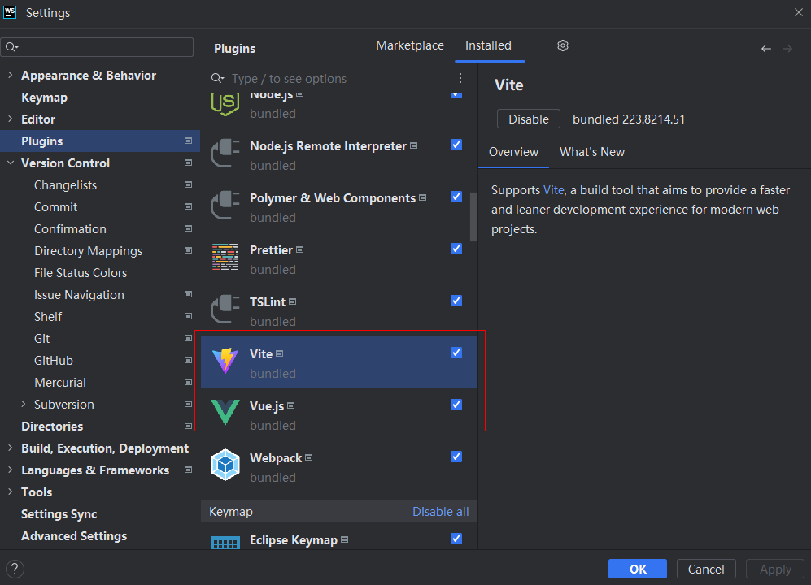
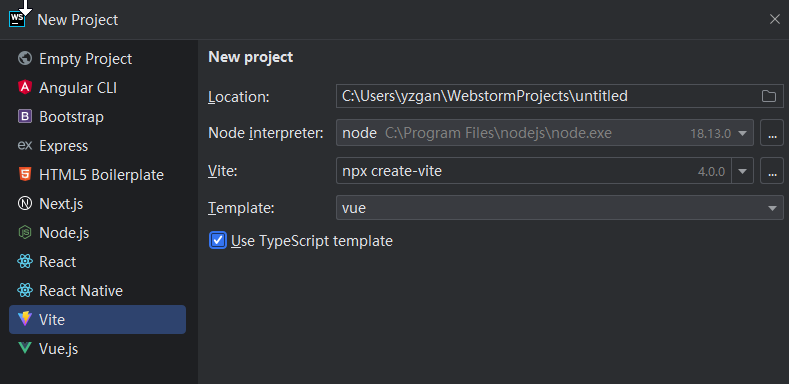
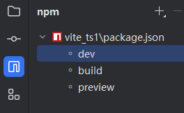
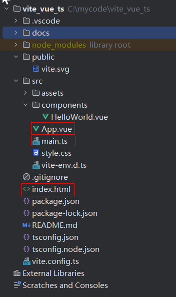
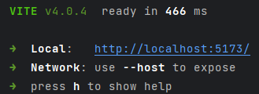
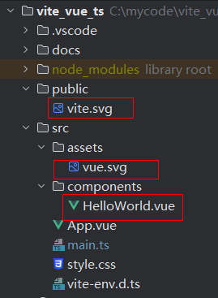
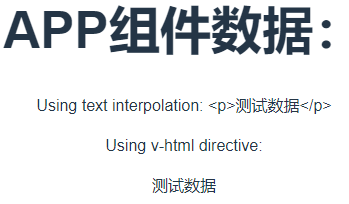
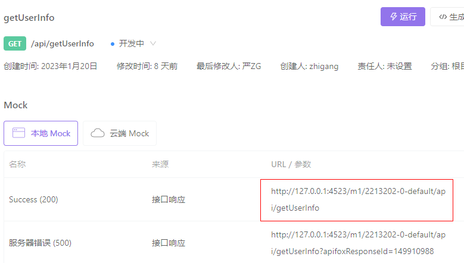
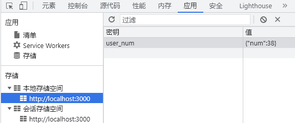

# Vue3 + Vite + TS

## 开发环境

1. Webstorm 安装插件



2. 创建Vite Vue项目



3. package.json

```
{
  "name": "vite_vue_ts",
  "private": true,
  "version": "0.0.0",
  "type": "module",
  "scripts": {
    "dev": "vite",
    "build": "vue-tsc && vite build",
    "preview": "vite preview"
  },
  "dependencies": {
    "vue": "^3.2.45"
  },
  "devDependencies": {
    "@vitejs/plugin-vue": "^4.0.0",
    "typescript": "^4.9.3",
    "vite": "^4.0.0",
    "vue-tsc": "^1.0.11"
  }
}
```

- npm run tasks



4. 默认文件



- index.html: 起始页面模版文件

```
<body>
    <!--  这里到id必须和main.ts里面的mount参数一致-->
    <div id="app"></div>  
    <!--装载根代码-->
    <script type="module" src="/src/main.ts"></script>
</body>
```

- mian.js: 根代码

```
import { createApp } from 'vue'
import './style.css'
import App from './App.vue' //注入根组件

createApp(App).mount('#app')  //app 与index.html中dom id 一致
```

- App.vue: 根组件

后缀名为 vue, 是推荐的SFC格式

5. 运行项目

num run dev



在vite.config.ts中配置启动端口

```
export default defineConfig({
  plugins: [vue()],
  server:{
    port:3000
  }
})
```

## Vue3基础

**本文中绝大多数代码将使用使用 Vue3.0 组合式，script-setup语法糖，TypeScript**

1. 清理文件
   

2. 移动APP.vue到 components目录下；修改main.ts中注入路径 ```import App from './components/App.vue'``` ;清空App.vue

```
<script setup lang="ts"></script> //model and controller

<template></template>  //template
 
<style scoped></style>  //style
```

现在就是一个空白页面。将在这个基础上介绍Vue的基本功能

- v-html: 修改APP.vue

```
<script setup lang="ts">
let rawHtml="<p>测试数据</p>"
</script>

<template>
    <h1>APP组件数据：</h1>
    <p>Using text interpolation: {{ rawHtml }}</p>
    <p>Using v-html directive: <span v-html="rawHtml"></span></p>
</template>
```

结果如下：



### 响应式数据

响应式数据必须使用 ref(简单数据)和reactive(对象，数组). Vue3的响应机制是基于Proxy和Reflect的而Vue2是基于Object.defineProperty。

```
<script setup lang="ts">
import {reactive, ref, toRef, toRefs} from 'vue'

const data = ref(1)
const btn1 = () => {
    data.value++
}

const obj =reactive({
    age:1,
    name:'xx'
})
const btn2 = () =>{
    obj.age++
}

const arr=reactive([1,2,3])
const btn5 = () =>{
    arr[0]++
}

const {a,b}= {
    a:ref(0),
    b:ref(1)
}
const btn3 = () =>{
    a.value ++
    b.value --
}
</script>

<template>
    <h1>APP组件数据：</h1>
    <div>响应式数据：{{data}} <button @click="btn1">修改</button></div>
    <div>响应式对象：{{obj}} <button @click="btn2">修改</button></div>
    <div>响应式对象2：{{a}},{{b}} <button @click="btn3">修改</button></div>
    <div>响应式数组：{{arr}} <button @click="btn5">修改</button></div>

</template>

<style scoped></style>
```

只有代理对象是响应式的，更改原始对象不会触发更新。因此，使用 Vue 的响应式系统的最佳实践是 仅使用你声明对象的代理版本。

reactive() API 有两条限制：

- 仅对对象类型有效（对象、数组和 Map、Set 这样的集合类型），而对 string、number 和 boolean 这样的 原始类型 无效。

- 因为 Vue 的响应式系统是通过属性访问进行追踪的，因此我们必须始终保持对该响应式对象的相同引用。这意味着我们不可以随意地“替换”一个响应式对象，因为这将导致对初始引用的响应性连接丢失

### 计算属性

类似定义get

```
<script setup lang="ts">
import {computed, reactive, ref, toRef, toRefs} from 'vue'

const data = ref(0);
const computedData = computed(() => {
    console.error('1111111111111111111')
    return data.value
})
let getData = () => {
    console.error('222222222222222222')
    return data.value
}

const btn = () => {
    data.value++
}
const data2 = ref(0)
const btn2 = () => {  //invoke btn2 will trigger getData() but use cached computedData
    data2.value++
}

</script>

<template>
    <h1>APP组件数据：</h1>
    <div>响应式数据：{{ computedData }}, {{ getData() }}
        <button @click="btn">修改</button>
    </div>
    <div>响应式数据2：{{ data2 }}
        <button @click="btn2">修改</button>
    </div>
</template>

<style scoped></style>
```

### 动态Class和Style

- 我们可以给 :class (v-bind:class 的缩写) 传递一个对象来动态切换 class
- :style 支持绑定 JavaScript 对象值，对应的是 HTML 元素的 style 属性

https://cn.vuejs.org/guide/essentials/class-and-style.html#binding-html-classes

### v-if

```
<script setup lang="ts">
import {ref} from 'vue'

let awesome = ref(true)

</script>

<template>
    <h1>APP组件数据：</h1>

    <button @click="awesome = !awesome">Toggle</button>
    <h1 v-if="awesome">Vue is awesome!</h1>
    <h1 v-else>Oh no 😢</h1>

    <h1 v-show="awesome">v-show</h1>
</template>

<style scoped></style>
```

还有 v-else-if

## **同时使用 v-if 和 v-for 是不推荐的，因为这样二者的优先级不明显。请查看风格指南获得更多信息。**

in Vue3 v-if > v-for, in Vue2 v-for > v-if

### v-for

```
<script setup lang="ts">
import {ref, reactive} from 'vue'

const items = reactive([{message: 'Foo'}, {message: 'Bar'}])
const myObject = reactive({
    title: 'How to do lists in Vue',
    author: 'Jane Doe',
    publishedAt: '2016-04-10'
})
const list = reactive(
    [
        {id: 1, value: "a"},
        {id: 2, value: "b"},
        {id: 3, value: "c"},
    ]
)
const remove = () => {
    list.map((item, index) => {
        if (item.id === selected.value) {
            list.splice(index, 1);
        }
    })
}
const onChange = () => {
    console.error('eeee', selected.value);
}
const selected = ref()
</script>

<template>
    <h1>APP组件数据：</h1>
    <li v-for="item in items">
        {{ item.message }}
    </li>
    <hr>
    <li v-for="(value, key, index) in myObject">
        {{ index }}. {{ key }}: {{ value }}
    </li>
    <hr>
    <span v-for="n in 10">{{ n }}</span>
    <hr>
    <ul>
        <li v-for='(item ,index) in list' :key="item.id">  //here use a static unique id is important!!!
            <input type="radio" :value="item.id" @change="onChange" v-model="selected">
            {{ item.value }}
        </li>
    </ul>
    <button @click="remove">remove</button>


</template>

<style scoped></style>
```

- 通过 key 管理状态
  https://blog.csdn.net/weixin_58032613/article/details/122862407

### 事件处理 v-on

用法：v-on:click="methodName" 或 @click="handler

有时我们需要在内联事件处理器中访问原生 DOM 事件。你可以向该处理器方法传入一个特殊的 $event 变量，或者使用内联箭头函数：

```
<!-- 使用特殊的 $event 变量 -->
<button @click="warn('Form cannot be submitted yet.', $event)">
  Submit
</button>

<!-- 使用内联箭头函数 -->
<button @click="(event) => warn('Form cannot be submitted yet.', event)">
  Submit
</button>

```

- 事件修饰符

在处理事件时调用 event.preventDefault() 或 event.stopPropagation() 是很常见的。尽管我们可以直接在方法内调用，但如果方法能更专注于数据逻辑而不用去处理
DOM 事件的细节会更好。

为解决这一问题，Vue 为 v-on 提供了事件修饰符。修饰符是用 . 表示的指令后缀，包含以下这些：

    stop
    prevent
    self
    capture
    once
    passive

```
<!-- 单击事件将停止传递 -->
<a @click.stop="doThis"></a>

<!-- 提交事件将不再重新加载页面 -->
<form @submit.prevent="onSubmit"></form>

<!-- 修饰语可以使用链式书写 -->
<a @click.stop.prevent="doThat"></a>

<!-- 也可以只有修饰符 -->
<form @submit.prevent></form>

<!-- 仅当 event.target 是元素本身时才会触发事件处理器 -->
<!-- 例如：事件处理器不来自子元素 -->
<div @click.self="doThat">...</div>
```

使用修饰符时需要注意调用顺序，因为相关代码是以相同的顺序生成的。
因此使用 @click.prevent.self 会阻止元素及其子元素的所有点击事件的默认行为
而 @click.self.prevent 则只会阻止对元素本身的点击事件的默认行为。

- 按键修饰符

```
<!-- 仅在 `key` 为 `Enter` 时调用 `submit` -->
<input @keyup.enter="submit" />

<!-- Alt + Enter -->
<input @keyup.alt.enter="clear" />

<!-- Ctrl + 点击 -->
<div @click.ctrl="doSomething">Do something</div>

```

- 鼠标按键修饰符:

      left
      right
      middle

https://cn.vuejs.org/guide/essentials/event-handling.html#event-modifiers

### 表单输入绑定

https://cn.vuejs.org/guide/essentials/forms.html

### 生命周期钩子以及动态组件

新建两个组件Child1 和Child2

Child1.vue: 打印生命周期事件

```
<template>
<h1>Child1</h1>
</template>

<script setup lang="ts">
import {onBeforeMount, onBeforeUnmount, onMounted, onUnmounted} from "vue";

onBeforeMount(()=>{
    console.error('c1:onBeforeMount')
})
onMounted(()=>{
    console.error('c1:onMounted')
})
onBeforeUnmount(()=>{
    console.error('c1:onBeforeUnmount')
})
onUnmounted(()=>{
    console.error('c1:onUnmounted')
})
</script>

<style scoped>

</style>
```

Child2.vue类似， 只有打印信息不同

App.vue: 动态组件

```
<script setup lang="ts">
import Child1 from './Child1.vue'  //导入子组件， 不需要注册
import Child2 from './Child2.vue'
import {ref, reactive, markRaw} from 'vue'

const coms = reactive([
    {id: 1, com: markRaw(Child1)},
    {id: 2, com: markRaw(Child2)}
])

const selected = ref(coms[0])  //not reactive here

const btn = () => {
    if (selected.value.id === 1) selected.value = coms[1]
    else selected.value = coms[0]
}

</script>

<template>
    <button @click="btn()">切换子组件</button>
<!--cache the component-->
    <keep-alive>
        <component :is="selected.com">AAA</component>
    </keep-alive>
</template>

<style scoped></style>
```

### watch

```
<template>
    <input type="text" name="input" v-model="msg">
</template>

<script setup lang="ts">
import {ref, watch} from 'vue'

let msg = ref("abc");

watch( ()=>msg.value,
    (newValue, oldValue) => {
        console.error(`msg: ${newValue} from ${oldValue}`);
    },
    {immediate: true}
)

</script>

<style scoped>

</style>
```

watch 的第一个参数可以是不同形式的“数据源”：它可以是一个 ref (包括计算属性)、一个响应式对象、一个 getter 函数、或多个数据源组成的数组

定义getter, setter

```
// 提供一个 getter 函数
watch(
  () => obj.count,
  (count) => {
    console.log(`count is: ${count}`)
  }
)

```

- watchEffect()
  watch 和 watchEffect 都能响应式地执行有副作用的回调。它们之间的主要区别是追踪响应式依赖的方式：

watch 只追踪明确侦听的数据源。它不会追踪任何在回调中访问到的东西。另外，仅在数据源确实改变时才会触发回调。watch
会避免在发生副作用时追踪依赖，因此，我们能更加精确地控制回调函数的触发时机。

watchEffect，则会在副作用发生期间追踪依赖。它会在同步执行过程中，自动追踪所有能访问到的响应式属性。这更方便，而且代码往往更简洁，但有时其响应性依赖关系会不那么明确。

- unwatch

https://cn.vuejs.org/guide/essentials/watchers.html#stopping-a-watcher

### 模板引用

虽然 Vue 的声明性渲染模型为你抽象了大部分对 DOM 的直接操作，但在某些情况下，我们仍然需要直接访问底层 DOM
元素。要实现这一点，我们可以使用特殊的 ref attribute

```
<script setup lang="ts">
import { ref, onMounted } from 'vue'

// 声明一个 ref 来存放该元素的引用
// 必须和模板里的 ref 同名
const input = ref(null)

onMounted(() => {
    input.value.focus()
})
</script>

<template>
    <input ref="input" />
</template>

<style scoped></style>

```

https://cn.vuejs.org/guide/essentials/template-refs.html#ref-on-component

### 组件间通讯

- 父到子
    - Props
    - v-model
- 子到父
    - emit
- 子到子
    - mitt

在子组件中定义需要传入的Props

```
const {msg} =defineProps({
    msg: {
        type: String,
        default: "111",
        required: true
    }
});
```

父组件在模版中传入属性值

```
<Child1 :msg="msgParent"></Child1>  //传入变量
<Child1 msg="abc"></Child1>  //传入常量
```

在子组件中定义发往父组件到事件

```
const emits = defineEmits<{
    (e: 'sayHello', msg: string): void   //事件id 是 'sayHello‘， 事件数据是一个string
}>()

const submit=()=>{
    emits('sayHello',msg.split('').reverse().join(''))  //触发sayHello事件
}

<button @click="submit">hello</button>  //页面触发按钮
```

在父组件中定义接受事件

```
<Child1 @sayHello="handleMsg"></Child1> //注意事件ID

const handleMsg = (m: string) => { //处理收到到事件数据
    msgFromChild.value = m
}

```

- 使用v-model实现父子数据同步更新
在子组件中定义prop, event
```
defineProps({numOfChild: {type: Number, default: 0}})
const emits = defineEmits<{
    (e: 'update:num-of-child', num: number): void //event id must follow'update:<属性命>'。 注意这里的大小写规则！
}>()
```

在父组件中使用v-model

```
<Child2 v-model:num-of-child="numOfParent"></Child2>
```
以下是完整代码

Child1.vue
```
<template>
<h1>Child1</h1>
    <div>子组件属性msg: {{msg}}</div>
    <button @click="submit">hello</button>
</template>

<script setup lang="ts">
const {msg} =defineProps({
    msg: {
        type: String,
        default: "111",
        required: true
    }
});

const emits = defineEmits<{
    (e: 'sayHello', msg: string): void
}>()

const submit=()=>{
    emits('sayHello',msg.split('').reverse().join(''))
}

</script>

<style scoped>

</style>
```
Child2.vue
```
<template>
    <h1>Child2</h1>
    <input type="number" :value="numOfChild" @input="update">
</template>

<script setup lang="ts">
defineProps({numOfChild: {type: Number, default: 0}})
const emits = defineEmits<{
    (e: 'update:num-of-child', num: number): void
}>()

const update = (ev: any) => {
    emits('update:num-of-child', parseInt(ev.target.value))  //key is 'update:num'
}
</script>

<style scoped>

</style>
```
App.vue
```
<script setup lang="ts">
import {ref} from 'vue'
import Child1 from "./Child1.vue"
import Child2 from "./Child2.vue"

const msgParent = ref('From Parent')
const msgFromChild = ref("default")
const numOfParent =ref(2);
const handleMsg = (m: string) => {
    msgFromChild.value = m
}
</script>

<template>
    <div>父组件数据str:{{msgFromChild}}</div>
    <Child1 :msg="msgParent" @sayHello="handleMsg"></Child1>
    <hr>
    <div>父组件数据num:{{numOfParent}}</div>
    <Child2 v-model:num-of-child="numOfParent"></Child2>
</template>

<style scoped></style>

```

- mitt
子组件祸任意组件间通讯有多种方法，这里介绍基于mitt的事件bus

首先安装mitt ```npm i mitt -S```
创建一个工具包， src下新建utils目录， 然后新建一个eventBus.ts文件

```
import mitt, {Emitter} from 'mitt'

export type Event = {
    topic: string,
    data?: any
}
export const Bus:Emitter<Event> = mitt<Event>();
```

实现从Child1发送数据到Child2

Child1.vue

```
<template>
    <h1>Child1</h1>
    <button @click="emitEvent">发送消息</button>
</template>

<script setup lang="ts">
import {Bus} from '../utils/eventBus'

let num  =0;
const emitEvent = () => {
    Bus.emit('evToChild2', {topic: 'test', data: num++})
}

</script>

<style scoped>

</style>
```

Child2.vue
```
<template>
    <h1>Child2</h1>
    <div>来自Child1的消息：{{event.topic}}:{{event.data}}</div>
</template>

<script setup lang="ts">
import {reactive, ref} from "vue";
import {Event, Bus} from '../utils/eventBus'
let event = reactive<Event>({topic: 'NA'})
Bus.on('evToChild2', (e: Event) => {
    event.topic = e.topic
    event.data = e.data
})
</script>

<style scoped>

</style>
```

App.vue

```
<script setup lang="ts">
import Child1 from "./Child1.vue"
import Child2 from "./Child2.vue"

</script>

<template>
    <Child1></Child1>
    <Child2></Child2>
</template>

<style scoped></style>

```


### slot

我们可能想要为子组件传递一些模板片段，让子组件在它们的组件中渲染这些片段。
```
//父
<FancyButton>
  Click me! <!-- 插槽内容 -->
</FancyButton>

//子
<button class="fancy-btn">
  <slot></slot> <!-- 匿名插槽出口 -->
</button>
```

一般使用具名slot

```
//子
    <div>Div1:
        <slot name="div1"></slot>
    </div>
    <div>Div2:
        <slot name="div2"></slot>
    </div>
    <div>Div3:
        <slot name="div3"></slot>
    </div>
    
//父
   <template v-slot:div1> Slot {{ data1 }}</template>
   <template #div2> Slot {{ data2 }}</template>  //v-slot简写
   <template #[dynamicSlot]> Slot {{ data3 }}</template>   //动态slot
```

插槽内容无法访问子组件的数据

 - 作用域插槽: 在某些场景下插槽的内容可能想要同时使用父组件域内和子组件域内的数据。要做到这一点，我们需要一种方法来让子组件在渲染时将一部分数据提供给插槽

```
//子
    <div v-for="item in items" :key="item.id">
        <slot :data="item"></slot>
    </div>
//父
    <template #default="{data}"> {{ data.age }}</template>
```


https://cn.vuejs.org/guide/components/slots.html#scoped-slots

完整代码

Child1.vue
```
<template>
    <h1>Child1</h1>
    <div>Div1:
        <slot name="div1"></slot>
    </div>
    <div>Div2:
        <slot name="div2"></slot>
    </div>
    <div>Div3:
        <slot name="div3"></slot>
    </div>
</template>

<script setup lang="ts">
</script>

<style scoped>

</style>
```

Childe2.vue
```
<template>
    <h1>Child2</h1>
    <div v-for="item in items" :key="item.id">
        <slot :data="item"></slot>
    </div>
</template>

<script setup lang="ts">
const items=[
    {id:1,name:'a',age:3},
    {id:2,name:'b',age:32},
    {id:3,name:'c',age:33},
    {id:4,name:'d',age:13},
]
</script>

<style scoped>

</style>
```

App.vue
```
<script setup lang="ts">
import Child1 from "./Child1.vue"
import Child2 from "./Child2.vue"
import {ref} from "vue";

const data1 = ref("a")
const data2 = ref("b")
const data3 = ref("c")

let dynamicSlot = 'div3'

</script>

<template>
    <Child1>
        <template v-slot:div1> Slot {{ data1 }}</template>
        <template #div2> Slot {{ data2 }}</template>
        <template #[dynamicSlot]> Slot {{ data3 }}</template>
    </Child1>
    <Child2>
        <template #default="{data}"> {{ data.age }}</template>
    </Child2>
</template>

<style scoped></style>

```
此时是可以比较有和没有:key的情况下, 选中第一个元素，点击按钮的结果


### 依赖注入

以创建logger service为例

新建src/services目录

创建LoggerService.ts

```
export default class LoggerService {
    log(module:string, msg: string):void{
        console.error(`[${module}]: ${msg}`);
    }
}
```

在main.ts中定义全局provide

```
import {createApp} from 'vue'
import App from './components/App/App.vue'
import LoggerService from "./services/LoggerService";
import './style.css'

const app = createApp(App)
app.provide(/*注入名*/'LoggerService',/*值*/ new LoggerService());
app.mount('#app');

```

在App.vue中注入并使用LoggerService

```
<script setup lang="ts">
import {inject, onMounted} from "vue";
import LoggerService from "../services/LoggerService";

const loggerService: LoggerService | undefined = inject('LoggerService');
const moduleName = 'App';

function log(msg: string) {
    loggerService?.log(moduleName, msg);
}

onMounted(()=>{
    log('mounted');
})
</script>

<template>

</template>

<style scoped></style>

```

https://cn.vuejs.org/guide/components/provide-inject.html#working-with-reactivity

### Server API
大多数情况下前台开发和后台（包括nodejs) API是两个独立项目

通过ApiFox定义一个新的API并自动生成模拟服务和数据



在vite.conf.ts中配置proxy

```
server:{
    port:3000,
    proxy: {
      '/api':'http://127.0.0.1:4523/m1/2213202-0-default'
    }
  }
```

安装axios库来同意使用API服务  ```npm i axios -S``
增加utils/request.ts来封装。
```
import axios from 'axios';

const service  = axios.create();

service.interceptors.request.use(
    config => {
        return config;
    },
    error => {
        return Promise.reject(error)
    }
);

service.interceptors.response.use(
    response => {
        return response;
    },
    error => {
        return Promise.reject(error)
    }
);

export default service;

```
为了解耦封装API。 

新建src/apis目录， 在其中定义API来使用前面模拟API服务

userInfo.ts

```
import request from '../utils/request'
import {catchError, from, Observable, of} from "rxjs";
import {map} from "rxjs/operators";
import {AxiosResponse} from "axios";

export interface UserInfo {
    name: string,
    age: number,
    sex: string
}

export function getUserInfo(): Observable<UserInfo[] | undefined> {
    return from(request({
        url: '/api/getUserInfo'
    })).pipe(
        map((res: AxiosResponse<any, any>) => {
            return res.data;
        }),
        catchError(error => {
            console.error('getUserInfo failed', error);
            return of(undefined);
        })
    );
}

```
这里使用了Rxjs， 所以要安装 ```npm i rxjs -S```

在App.vue中使用api来获取数据

```
<script setup lang="ts">
import {getUserInfo, UserInfo} from '../apis/userInfo';
import {onBeforeMount, ref} from "vue";
import {map} from "rxjs/operators";

const users = ref<UserInfo[]>([]);
onBeforeMount(() => {
    getUserInfo().pipe(
        map((users:UserInfo[]) => {  //add static unique id for v-for
            users.forEach((u,i)=>u.id=i)
            return users;
        })).subscribe((res: UserInfo[]) => {
        if (res) {
            users.value = res;
        }
    })
})
</script>

<template>
    <h1>App 数据</h1>
    <ul>
        <li v-for='user in users' :key='user.id'>
            {{ user.name }}({{ user.sex }}):{{ user.age }}
        </li>
    </ul>
</template>

<style scoped></style>

```

### 异步组件
在大型项目中，我们可能需要拆分应用为更小的块，并仅在需要时再从服务器加载相关组件。Vue 提供了 defineAsyncComponent 方法来实现此功能
- 延迟加载，优化性能
- 打包分包，优化初始化装载速度

重写Child1.vue

```
<template>
    <h1>Child1</h1>
</template>

<script setup lang="ts">
import {onBeforeMount} from "vue";
import {getUserInfo} from '../apis/userInfo'
onBeforeMount(()=>{
    getUserInfo()
})
</script>

```
在APP.vue中引入Child1并定义为异步组件
```
<script setup lang="ts">
import {defineAsyncComponent} from "vue";

const Child1 = defineAsyncComponent(()=> import ("./Child1.vue"))

</script>

<template>
    <h1>App 数据</h1>
    <suspense>
        <template #default>  //#default, #fallback是系统常量
            <Child1></Child1>
        </template>
        <template #fallback>  
            loading... //未完成装在前显示
        </template>
    </suspense>
</template>

<style scoped></style>
```

测试时可以设置浏览器模拟3G网络速度。


```<Suspense>``` 是一个内置组件，用来在组件树中协调对异步依赖的处理。它让我们可以在组件树上层等待下层的多个嵌套异步依赖项解析完成，并可以在等待时渲染一个加载状态。

https://cn.vuejs.org/guide/components/async.html#loading-and-error-states

### Pinia 状态管理
替代Vuex https://pinia.web3doc.top/

- state
- getters
- actions


安装 ```npm i pinia -S```
在 mian.ts中引入
```
import { createApp } from 'vue'
import './style.css'
import App from './components/App.vue' //注入根组件
import LoggerService from "./services/LoggerService"
import {createPinia} from 'pinia'

const app = createApp(App)
app.use(createPinia())
app.provide(/*注入名*/'LoggerService',/*值*/ new LoggerService());
app.mount('#app');
```
新建目录 src/store
创建一个userStore.ts

```
import {defineStore} from 'pinia'

export const userStore = defineStore('userModel', {  //第一个参数要唯一
    state: () => {
        return {  //返回到数据对象
            num: 0,
            name: "abc"
        }
    },
    getters: {  //计算属性
        reversedName(): string {
            return this.name.split('').reverse().join('')
        }
    },
    actions: {  //方法
        growupAction(val: number): void {
            this.num += val
        }
    }
})
```

在Child1.vue中使用store

```
<template>
    <h1>Child1</h1>
    <div> I am {{name}}. I am {{num}} years old</div>
    <button @click="growup">涨一岁</button>
    <div>name mirror: {{store.reversedName}}</div>
    <button @click="growupAction">涨十岁</button>
    <br>
    <button @click="reset">reset</button>
</template>

<script setup lang="ts">

import {userStore} from "../store/userStore";
import {storeToRefs} from "pinia";

const store = userStore()
let {name, num} = storeToRefs(store) //解构并响应
const growup=()=>{
    num.value++;
    //如果不使用storeToRefs,可以通过$patch方法
    /*store.$patch(state=>{
        state.name="zhangsan"
        state.num ++
    })*/
}

const growupAction=()=>{
    store.growupAction(10) //调用 store actions
}

const reset=()=>{
    store.$reset() //重置数据到初始化状态
}


</script>

<style scoped>

</style>
```

### Pinia持久化存储

安装插件 ```npm i pinia-plugin-persist -S```

封装pinia初始化到 /store/index.ts中

```
import {createPinia} from "pinia"
import piniaPluginPersist from 'pinia-plugin-persist'

const store = createPinia()
store.use(piniaPluginPersist)

export default store

```

修改 main.ts

```
import { createApp } from 'vue'
import './style.css'
import App from './components/App.vue' //注入根组件
import store from './store'

const app = createApp(App)
app.use(store)
app.mount('#app')
```

配置 userStore.ts 

```
import {defineStore} from 'pinia'

export const userStore = defineStore('userModel', {
    state: () => {
        return {
            num: 0,
            name: "abc"
        }
    },
    getters: {
        reversedName(): string {
            return this.name.split('').reverse().join('')
        }
    },
    actions: {
        growupAction(val: number): void {
            this.num += val
        }
    },
    persist: {  //持久化配置
        enabled: true,  //默认使用会话存储（不定义strategies)，刷新会保留，打开页新面会重置, id 为defineStore的第一个参数
        strategies:[
            {
                key: "user_num",
                storage:localStorage, //localStorage数据存在本地文件中， 打开页新面会保留之前状态
                paths:['num'] //指定存储的属性，默认存储所有属性
            },
            {
                key: "user_name",
                storage: sessionStorage,
                paths:['name']
            }
        ]
    }
})
```

测试时候可以修改persist选项来获得不同效果

在浏览器中也可以获得持久化信息




### vue-router 路由

https://router.vuejs.org/zh/

1. 安装插件 ```npm i vue-router -S```

2. 创建 /router/index.ts

```
import {createRouter, createWebHistory, RouteRecordRaw} from 'vue-router'
const routers: Array<RouteRecordRaw> = [
    {
        path: '/',
        name: 'login',
        component: () =>import ('../components/Child1.vue') //懒加载
    },
    {
        path: '/home',
        name: 'home',
        component: () =>import ('../components/Child2.vue')
    }
]
const router = createRouter({
    history: createWebHistory(), //路由模式
    routes:routers
})

export default router
```

在定义API component的时候，推荐按这种写法。
- 这里引用到的组件的组件在打包时会进行分包，从而提高程序启动性能

```
> vite_vue_ts@0.0.0 build
> vue-tsc && vite build

vite v4.0.4 building for production...
✓ 29 modules transformed.
dist/index.html                  0.50 kB                 
dist/assets/index-c16bd851.css   1.04 kB │ gzip:  0.56 kB
dist/assets/Child2-46b13e5e.js   0.16 kB │ gzip:  0.16 kB
dist/assets/Child1-c57ba987.js   0.16 kB │ gzip:  0.16 kB
dist/assets/index-0d804368.js   77.06 kB │ gzip: 30.71 kB

```
 - 可以这样写。 这样到话， Child1就会打入到index.js中，在项目初始阶段就被装载。
```
import Child1 from "../components/Child1.vue";
...
component: Child1
```

3. 修改main.ts引入插件
```
import { createApp } from 'vue'
import './style.css'
import App from './components/App.vue' //注入根组件
import router from './router'

createApp(App).use(router).mount('#app')
```

4. 在App.vue中加入容器
```
<script setup lang="ts">

</script>

<template>
    <h1>App 数据</h1>
    <router-view></router-view>
</template>

<style scoped></style>
```

Child1.vue

```
<template>
    <h1>Child1</h1>
</template>
```

Child2.vue
```
<template>
    <h1>Child2</h1>
</template>
```
测试： 分别访问localhost:3000 和localhost:3000/home

--------------------------------------------------------------------

 - 页面跳转： 通过页面DOM或者代码来控制跳转

更新index.ts

```
import {createRouter, createWebHistory, RouteRecordRaw} from 'vue-router'
import Child1 from "../components/Child1.vue";
const routers: Array<RouteRecordRaw> = [
    {
        path: '/',
        redirect:'/login'  //访问 '/' 会自动跳转到 '/login'
    },
    {
        path: '/login',
        name: 'login',
        component: Child1
    },
    {
        path: '/home',
        name: 'home',
        component: () =>import ('../components/Child2.vue')
    }
]
const router = createRouter({
    history: createWebHistory(), //路由模式
    routes:routers
})

export default router
```

APP.vue

```
<script setup lang="ts">
import {useRouter} from 'vue-router'

const router = useRouter()

const navTo=(to:any)=>{
    router.push(to)  //跳转到path
}
</script>

<template>
    <h1>App 数据</h1>
    <h2> 通过router-link跳转</h2>
    <router-link to="/login">To Child1</router-link>
    <router-link style="margin-left:10px" :to="{name: 'home'}">To Child2</router-link>
    <hr>
    <h2>通过代码跳转</h2>
    <button @click="navTo('/login')">To Child1</button>
    <button style="margin-left:10px" @click="navTo({name: 'home'})">To Child2</button>
    <hr>
    <router-view></router-view>
</template>
```
上例中展现了两种跳转方式：
- 通过router-link
- 通过代码控制
在传递跳转目标的时候分别使用了path和name两种方式。目前这两种方式的结果是一样的，推荐使用命名的方式，和API path解耦。
--------------------------------------------------------------------
- 路由传参

常用的方式有几种： 通过query参数， 通过params参数。
需要注意的是，从vue-router 4.1.4开始不再支持银式params参数，
就是说: <font color="red">**params中的参数必须在API path中预定义**</font>
    

新建一个路由
```
{
    path:'/user/byQuery',
    name:'userByQuery',
    component:() => import('../components/UserDetails.vue')
}
```
通过router.push来跳转和传参
```
const showDetailsByQuery = (id: number) => {
    router.push({
        name: 'userByQuery',
        query: {id: id}
    })
}
```

创建第二个路由。 <font color="red">注意： 从4.1.4起不再支持</font>
```
{
    path:'/user/byParams',
    name:'userByParams',
    component:() => import('../components/UserDetails2.vue')
}
```
通过router.push来跳转和传参. 

```
const showDetailsByParam = (id: number) => {
    router.push({
        name: 'userByParams',
        params: {id: id}  
    })
}
```

创建第三个路由。

```
{
    path:'/user/:id',  //在path中定义params中的变量
    name:'userByPath',
    component:() => import('../components/UserDetails2.vue')
}
```
通过router.push来跳转和传参.

```
const showDetailsByPath = (id: number) => {
    router.push({
        name: 'userByPath',
        params: {id: id}  
    })
}
```

从vue-router 4.1.4起，所有传递的参数都会显示在URL上，这样的好处是刷新页面的时候不会丢失数据。（隐式的params有这个问题）。
但同样的我们可能不希望敏感数据显示的URL上，或者我们要传递的参数超过的URL的最大长度。遇到这类情况就要
a. 重新设计API和Component,不传递全数据，而值传递查询条件，数据在跳转后由新组建自行获取
b. 结合pinia

完整代码：

App.vue

```
<template>
    <router-view></router-view>
</template>

```

Child1.vue
```
<template>
    <h1>Child1</h1>

    <h1>App 数据</h1>
    <h2>通过query传递</h2>
    <ul>
        <li v-for="d in data" :key="d.id">
            <button @click="showDetailsByQuery(d.id)">{{ d.name }}</button>
        </li>
    </ul>
    <hr>
    <h2>通过隐式param传递</h2>
    <ul>
        <li v-for="d in data" :key="d.id">
            <button @click="showDetailsByParam(d.id)">{{ d.name }}</button>
        </li>
    </ul>
    <hr>
    <h2>通过path param传递</h2>
    <ul>
        <li v-for="d in data" :key="d.id">
            <button @click="showDetailsByPath(d.id)">{{ d.name }}</button>
        </li>
    </ul>
</template>

<script setup lang="ts">
import {useRouter} from 'vue-router'
import {data} from '../data/data.json'

const router = useRouter()

const showDetailsByQuery = (id: number) => {
    router.push({
        name: 'userByQuery',
        query: {id: id}
    })
}

const showDetailsByParam = (id: number) => {
    router.push({
        name: 'userByParams',
        params: {id: id}  //从4.14起不再支持
    })
}

const showDetailsByPath = (id: number) => {
    router.push({
        name: 'userByPath',
        params: {id: id}
    })
}
</script>

```

UserDetails.vue

```
<template>
    <h2>UserDetails: from Query</h2>
    <div>
        id: {{ user?.id }}<br>
        name: {{user?.name}}<br>
        age: {{user?.age}}<br>
    </div>

    <br>
    <button @click="back">Back</button>
</template>

<script setup lang="ts">
import {useRoute,useRouter} from 'vue-router'
import {data} from '../data/data.json'
import {ref, watchEffect} from "vue";
import {UserInfo} from "../types/UserType";

const route = useRoute()  //route 只读对象，用来获取传入的数据
const router =useRouter()  //router 只写对象，完成路由功能

const user = ref<UserInfo|undefined>()
watchEffect(()=>{  //router.query 不是响应式数据，需要watch来监控变化
    user.value = data.find((user) => user.id === Number(route.query?.id))
})

const back =()=>{  //增加返回按钮，用代码功能实现浏览器相同功能
    router.back()
}
</script>

```

UserDetails2.vue
```
<template>
    <h2>UserDetails2: from params</h2>
    <div>
        id: {{ user?.id }}<br>
        name: {{user?.name}}<br>
        age: {{user?.age}}<br>
    </div>

    <br>
    <button @click="back">Back</button>
</template>

<script setup lang="ts">
import {useRoute, useRouter} from 'vue-router'
import {data} from '../data/data.json'
import {ref, watchEffect} from "vue"
import {UserInfo} from "../types/UserType"

const route = useRoute()
const router =useRouter()

const user = ref<UserInfo|undefined>()
watchEffect(()=>{
    user.value = data.find((user) => user.id === Number(route.params?.id))
})

const back =()=>{
    router.back()
}

</script>

<style scoped>

</style>
```
UserDetails3.vue
```
<template>
    <h2>UserDetails: from Query</h2>
    <div>
        id: {{ user?.id }}<br>
        name: {{user?.name}}<br>
        age: {{user?.age}}<br>
    </div>

    <br>
    <button @click="back">Back</button>
</template>

<script setup lang="ts">
import {useRoute,useRouter} from 'vue-router'
import {data} from '../data/data.json'
import {ref, watchEffect} from "vue";
import {UserInfo} from "../types/UserType";

const route = useRoute()
const router =useRouter()

const user = ref<UserInfo|undefined>()
watchEffect(()=>{
    user.value = data.find((user) => user.id === Number(route.params.id))
})

const back =()=>{
    router.back()
}
</script>

<style scoped>

</style>
```
src/router/index.ts
```
import {createRouter, createWebHistory, RouteRecordRaw} from 'vue-router'
import Child1 from "../components/Child1.vue";
const routers: Array<RouteRecordRaw> = [
    {
        path: '/',
        redirect:'/login'  //访问 '/' 会自动跳转到 '/login'
    },
    {
        path: '/login',
        name: 'login',
        component: Child1
    },
    {
        path: '/home',
        name: 'home',
        component: () =>import ('../components/Child2.vue')
    },
    {
        path:'/user/byQuery',
        name:'userByQuery',
        component:() => import('../components/UserDetails.vue')
    },
    {
        path:'/user/byParams',
        name:'userByParams',
        component:() => import('../components/UserDetails2.vue')
    },
    {
        path:'/user/:id',
        name:'userByPath',
        component:() => import('../components/UserDetails2.vue')
    }
]
const router = createRouter({
    history: createWebHistory(), //路由模式
    routes:routers
})

export default router
```

src/data/data.json
```
{
    "data": [
        {
            "id": 1,
            "name": "Zhangsang",
            "age": 32
        },
        {
            "id": 2,
            "name": "Lisi",
            "age": 13
        },
        {
            "id": 3,
            "name": "Wangwu",
            "age": 53
        }
    ]
}
```
src/types/UserTypes.ts

```
export type UserInfo = {
    id: number,
    name: string,
    age: number
}
```
----------------------------------

- 路由嵌套（子路由）

上例中三个user相关的API都是以 /user开始的，可以使用子路由的方式重新定义

```
{
    path:'/user',
    children:[
        {
            path:'byQuery',  // /user/byQuery
            name:'userByQuery',
            component:() => import('../components/UserDetails.vue')
        },
        {
            path:'byParams',  // /user/byParams
            name:'userByParams',
            component:() => import('../components/UserDetails2.vue')
        },
        {
            path:':id',  // /user/:id
            name:'userByPath',
            component:() => import('../components/UserDetails2.vue')
        }
    ]
}
```
子路由可以无限嵌套

### SSR
TODO

## Setup API Server by NodeJS & Express in Type Script

创建一个新的npm项目

package.json
```
{
  "name": "api_server",
  "version": "1.0.0",
  "main": "build/index.js",
  "scripts": {
    "start": "tsc && node .",
    "build": "tsc",
    "dev": "tsc -w  & nodemon .",
    "test": "echo \"Error: no test specified\" && exit 1"
  },
  "keywords": [],
  "author": "zhigang",
  "license": "ISC",
  "dependencies": {
    "express": "^4.18.2"
  },
  "devDependencies": {
    "@types/express": "^4.17.16",
    "@types/node": "^18.11.18",
    "nodemon": "^2.0.20",
    "typescript": "^4.9.4"
  },
  "description": ""
}

```

在根目录下新建tsconfig.json

```
{
    "compilerOptions": {
        "module": "commonjs",
        "target": "es2022",
        "sourceMap": true,
        "noImplicitAny": true,
        "moduleResolution": "node",
        "outDir": "build",
        "allowSyntheticDefaultImports": true,
        "baseUrl": "."
    },
    "include": [
        "src/**/*"
    ],
    "exclude": [
        "node_modules",
        "build"
    ]
}
```

src/index.ts

```
import * as express from 'express' //不能写 import express from 'express'

const app= express()

app.get('/', (req,res)=>{
    res.send({msg:'test'})
})

//more API

const port=3001

app.listen(port, ()=>{
    console.log(`API Server Started on port ${port}`)
})
```

- 运行方法

npm run build
npm run start

如果运行 npm run dev会自动监控源码变化并自动build，但是还要重启npm run start才能生效 (可能需进一步配置)